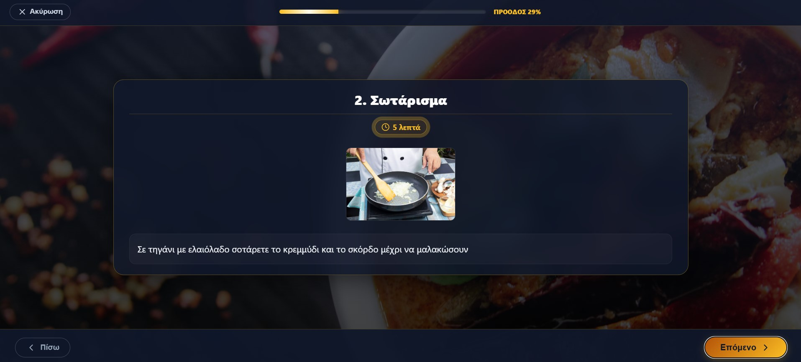

#  Recipe Ebook Application

Μια πλήρης Full Stack εφαρμογή διαχείρισης και εκτέλεσης συνταγών μαγειρικής. Η εφαρμογή επιτρέπει στους χρήστες να δημιουργούν, να επεξεργάζονται και να εκτελούν συνταγές μέσω ενός custom και διαδραστικού περιβάλλοντος.

##  Βασικά Χαρακτηριστικά (Features)

* **Διαχείριση Συνταγών (CRUD):** Δημιουργία, Ανάγνωση, Ενημέρωση και Διαγραφή συνταγών.
* **Εκτέλεση Συνταγών:** Λειτουργία "Εκτέλεσης" με βήμα-προς-βήμα καθοδήγησηα και progress bar.
* **Φωτογραφίες:** Υποστήριξη πολλαπλών φωτογραφιών ανά συνταγή και ανά βήμα εκτέλεσης.
* **Υλικά & Βήματα:** Λεπτομερής καταγραφή υλικών με μονάδες μέτρησης και αντιστοίχιση υλικών σε βήματα.


##  Τεχνολογίες (Tech Stack)

### Frontend (Client)
* **React.js** (Hooks, Components)
* **CSS Modules** (Styling για κάθε component)
* **Axios** (HTTP Requests προς το Backend)
* **Lucide React** (React Icons)

### Backend (Server)
* **Java Spring Boot** (REST API)
* **Hibernate / JPA** (Database ORM)
* **MySQL 8.0** (Database)

### DevOps
* **Docker & Docker Compose** (Containerization όλης της εφαρμογής)


## Εγκατάσταση & Εκτέλεση (Installation)

Η εφαρμογή είναι σχεδιασμένη να τρέχει άμεσα μέσω Docker, χωρίς να χρειάζεται εγκατάσταση Java ή Node.js στον υπολογιστή σας.

### Προαπαιτούμενα
* [Docker Desktop](https://www.docker.com/products/docker-desktop) (Εγκατεστημένο και να τρέχει).

## Εγκατάσταση & Εκτέλεση (Installation)

Η εφαρμογή είναι σχεδιασμένη να τρέχει άμεσα μέσω Docker.

### Προαπαιτούμενα
* [Docker Desktop](https://www.docker.com/products/docker-desktop) (Εγκατεστημένο και να τρέχει).
## 🚀 Εγκατάσταση & Εκτέλεση (Installation)

Η εφαρμογή είναι σχεδιασμένη να τρέχει άμεσα μέσω Docker.

### Προαπαιτούμενα
* [Docker Desktop](https://www.docker.com/products/docker-desktop) (Εγκατεστημένο και να τρέχει).

### Οδηγίες Βήμα-προς-Βήμα

1.  **Κατεβάστε τον Κώδικα:**
    Ανοίξτε τερματικό και εκτελέστε τις παρακάτω εντολές για να κατεβάσετε το project:
    ```bash
    git clone [https://github.com/](https://github.com/)[το-username-σου]/recipeWebApp.git
    cd recipeWebApp
    ```
    *(Αντικαταστήστε το `[το-username-σου]` με το όνομά σας στο GitHub)*

2.  **Δημιουργία Αρχείου Περιβάλλοντος (.env):**
    ⚠️ **Σημαντικό:** Το αρχείο `.env` λείπει για λόγους ασφαλείας. Πρέπει να το δημιουργήσετε εσείς.
    
    * Μέσα στον φάκελο `recipeWebApp` (δίπλα στο `docker-compose.yml`), δημιουργήστε ένα νέο αρχείο με όνομα `.env`.
    * Αντιγράψτε και επικολλήστε μέσα τον παρακάτω κώδικα:

    ```env
    # --- Ρυθμίσεις Frontend ---
    REACT_APP_API_URL=http://localhost:8080/api
    WDS_SOCKET_PORT=0
    
    # --- Ρυθμίσεις Βάσης Δεδομένων (MySQL) ---
    MYSQL_ROOT_PASSWORD=root
    MYSQL_DATABASE=recipedb
    MYSQL_USER=user
    MYSQL_PASSWORD=password
    ```

3.  **Εκκίνηση Εφαρμογής:**
    Στο τερματικό (μέσα στον φάκελο `recipeWebApp`), τρέξτε:
    ```bash
    docker-compose up -d --build
    ```
    *Η εντολή αυτή θα χτίσει τα images και θα ξεκινήσει τα containers για το Frontend (`recipe`), το Backend (`recipe-management-system`) και τη Βάση.*

4.  **Πρόσβαση:**
    Περιμένετε λίγα λεπτά να ξεκινήσουν όλα τα services και μπείτε εδώ:
    * 🌐 **Frontend (Web App):** [http://localhost:3000](http://localhost:3000)
    * ⚙️ **Backend (API):** [http://localhost:8080](http://localhost:8080)

5.  **Τερματισμός:**
    Για να σταματήσετε την εφαρμογή:
    ```bash
    docker-compose down
    ```
### Οδηγίες Βήμα-προς-Βήμα

1.  **Κατεβάστε τον Κώδικα:**
    Ανοίξτε τερματικό και εκτελέστε τις παρακάτω εντολές για να κατεβάσετε το project:
    ```bash
    git clone [https://github.com/](https://github.com/)[το-username-σου]/recipeWebApp.git
    cd recipeWebApp
    ```
    *(Αντικαταστήστε το `[το-username-σου]` με το όνομά σας στο GitHub)*

2.  **Δημιουργία Αρχείου Περιβάλλοντος (.env):**
     **Σημαντικό:** Το αρχείο `.env` λείπει για λόγους ασφαλείας. Πρέπει να το δημιουργήσετε εσείς.
    
    * Μέσα στον φάκελο `recipeWebApp` (δίπλα στο `docker-compose.yml`), δημιουργήστε ένα νέο αρχείο με όνομα `.env`.
    * Αντιγράψτε και επικολλήστε μέσα τον παρακάτω κώδικα:

    ```env
    # --- Ρυθμίσεις Frontend ---
    REACT_APP_API_URL=http://localhost:8080/api

    
    # --- Ρυθμίσεις Βάσης Δεδομένων (MySQL) ---
    MYSQL_ROOT_PASSWORD=root
    MYSQL_DATABASE=recipedb
    MYSQL_USER=user
    MYSQL_PASSWORD=password
    ```

3.  **Εκκίνηση Εφαρμογής:**
    Στο τερματικό (μέσα στον φάκελο `recipeWebApp`), τρέξτε:
    ```bash
    docker-compose up -d --build
    ```
    *Η εντολή αυτή θα χτίσει τα images και θα ξεκινήσει τα containers για το Frontend (`recipe`), το Backend (`recipe-management-system`) και τη Βάση.*

4.  **Πρόσβαση:**
    Περιμένετε λίγα λεπτά να ξεκινήσουν όλα τα services και μπείτε εδώ:
    *  **Frontend (Web App):** [http://localhost:3000](http://localhost:3000)
    *  **Backend (API):** [http://localhost:8080](http://localhost:8080)

5.  **Τερματισμός:**
    Για να σταματήσετε την εφαρμογή:
    ```bash
    docker-compose down
    ```

##  Δομή Κώδικα (Project Structure)

Η δομή του Frontend είναι οργανωμένη σε Components και Pages για ευκολία συντήρησης:

```text
RECIPE/
├── src/
│   ├── api/                          # Υπηρεσίες Axios για κλήσεις στο Backend
│   │   ├── ingredientApi.js
│   │   ├── PhotoApi.js
│   │   ├── recipeApi.js
│   │   ├── recipeIngredientApi.js
│   │   └── stepApi.js
│   ├── components/                   # Επαναχρησιμοποιήσιμα UI Components
│   │   ├── recipe-form/              # Components για φόρμες εισαγωγής
│   │   │   ├── BasicInfoForm.js
│   │   │   ├── IngredientSelector.js
│   │   │   └── StepsForm.js
│   │   ├── recipe-list/              # Components εμφάνισης λίστας
│   │   │   └── RecipeCard.js
│   │   ├── recipe-search/            # Components αναζήτησης & φίλτρων
│   │   │   └── RecipeSearch.js
│   │   └── UI/                       # Κοινά στοιχεία (Buttons, Galleries)
│   │       ├── BackButton.js
│   │       ├── PhotoGallery.js
│   │       └── PhotoUploader.js
│   ├── pages/                        # Οι κύριες σελίδες (Screens) της εφαρμογής
│   │   ├── EditPage/                 # Υπο-σελίδες για την επεξεργασία συνταγής
│   │   │   ├── EditRecipe.js
│   │   │   ├── EditRecipeIngredients.js
│   │   │   ├── EditRecipePhotos.js
│   │   │   └── EditRecipeSteps.js
│   │   ├── CreateRecipePage.js       # Σελίδα δημιουργίας νέας συνταγής
│   │   ├── RecipeDetailsPage.js      # Σελίδα προβολής λεπτομερειών
│   │   ├── RecipeExecution.js        # Mode Εκτέλεσης (Step-by-step & Timer)
│   │   └── RecipeListPage.js         # Αρχική σελίδα με λίστα συνταγών
│   ├── utils/                        # Βοηθητικά αρχεία & σταθερές
│   │   └── enums.js
│   ├── App.js                        # Main Router & Layout setup
│   └── index.js                      # Entry Point της React
├── .env                              # Environment Variables (API URL, Ports)
├── docker-compose.yml                # Ρυθμίσεις Docker Services
├── Dockerfile                        # Οδηγίες χτισίματος (Build) Frontend Container
└── package.json                      # Dependencies & Scripts
```

## 📖 Αναλυτική Περιγραφή Components

### 🔌 API Services (`src/api/`)
Αρχεία που διαχειρίζονται την επικοινωνία με το Backend μέσω **Axios**.
* **`recipeApi.js`**: Διαχειρίζεται όλες τις CRUD ενέργειες για τις συνταγές (GET, POST, PUT, DELETE).
* **`PhotoApi.js`**: Υπεύθυνο για το upload και τη διαγραφή φωτογραφιών στον server.
* **`stepApi.js`**: Διαχειρίζεται τη δημιουργία και επεξεργασία των βημάτων εκτέλεσης ξεχωριστά.
* **`ingredientApi.js` & `recipeIngredientApi.js`**: Ανακτούν τη λίστα διαθέσιμων υλικών και διαχειρίζονται τα υλικά μιας συγκεκριμένης συνταγής.

### 🧩 UI & Forms (`src/components/`)
* **`recipe-form/BasicInfoForm.js`**: Φόρμα εισαγωγής βασικών στοιχείων (Τίτλος, Περιγραφή, Χρόνος, Δυσκολία).
* **`recipe-form/IngredientSelector.js`**: Component για την επιλογή υλικών καθώς και της μονάδας μέτρησης του εκάστοτε υλικού.
* **`recipe-list/RecipeCard.js`**: Κάρτα προβολής της συνταγής που εμφανίζει τη σύνοψή της, εμπεριέχοντας χαρακτηριστικά όπως φωτογραφία, τίτλο και tags.
* **`recipe-search/RecipeSearch.js`**: Component αναζήτησης με φίλτρα για κατηγορία και επίπεδο δυσκολίας.
* **`UI/PhotoGallery.js`**: Επαναχρησιμοποιούμενο component που εμφανίζει πλέγμα (grid) φωτογραφιών με δυνατότητα προβολής σε πλήρη οθόνη.
* **`UI/PhotoUploader.js`**: Component για Drag & Drop μεταφόρτωση εικόνων με προεπισκόπηση.

### 📱 Pages & Screens (`src/pages/`)
Οι κεντρικές οθόνες της εφαρμογής που συνθέτουν τα επιμέρους components.

#### Επεξεργασία (`EditPage/`)
* **`EditRecipe.js`**: Η κεντρική σελίδα επεξεργασίας. Διαχειρίζεται τη συνταγή και συντονίζει τα υπόλοιπα components.
* **`EditRecipeIngredients.js`**: Διαχειρίζεται τη λίστα των υλικών (προσθήκη, αφαίρεση, ποσότητες) κατά την επεξεργασία.
* **`EditRecipeSteps.js`**: Σύνθετο component για τη διαχείριση βημάτων. Επιτρέπει την προσθήκη κειμένου, φωτογραφιών και αντιστοίχιση υλικών σε κάθε βήμα.
* **`EditRecipePhotos.js`**: Διαχειριστής της συλλογής φωτογραφιών της συνταγής.

#### Κύριες Σελίδες
* **`RecipeListPage.js`**: Η αρχική σελίδα (Home). Φορτώνει και εμφανίζει όλες τις συνταγές σε πλέγμα.
* **`RecipeDetailsPage.js`**: Σελίδα λεπτομερειών. Εμφανίζει πλήρως τα υλικά, τη διαδικασία και τις φωτογραφίες σε View Mode.
* **`RecipeExecution.js`**: Λειτουργία εκτέλεσης συνταγής η οποία όταν εφαρμοστεί καλύπτει πλήρως το UI, εμφανίζει βήμα-προς-βήμα οδηγίες και διαθέτει progress bar.
* **`CreateRecipePage.js`**: Οδηγός για τη δημιουργία νέας συνταγής από το μηδέν.

### 🛠️ Utilities (`src/utils/`)
* **`enums.js`**: Περιέχει σταθερές τιμές (π.χ. Μονάδες Μέτρησης, Επίπεδα Δυσκολίας) που χρησιμοποιούνται σε όλη την εφαρμογή για αποφυγή hard-coded strings.

## Φωτογραφίες Καθοδήγης και Ενημέρωσης της Εφαρμογής

### Αρχική & UI
Επισκόπηση της αρχικής σελίδας, της αναζήτησης μια συνταγής και της λίστας των Συνταγών.

| UI | Αναζήτηση | Λίστα Συνταγών |
|:---:|:---:|:---:|
|  |  |    |

### Προβολή Λεπτομερειών
Επισκόπηση της Καρτέλας μιας συνταγής που περιλαμβάνει τα υλικά της, τα βήματα της και τις φωτογραφίες της!

| Καρτέλα Συνταγής | Υλικά & Βήματα | Φωτογραφίες Συνταγής |
|:---:|:---:|:---:|
|  |  |  |

### Δημιουργία Συνταγής
Η διαδικασία δημιουργίας νέας συνταγής βήμα-προς-βήμα.

| Δημιουργία Συνταγής |Προσθήκη Υλικών Συνταγής | Προσθήκη Βημάτων Συνταγής | Προσθήκη Φωτογραφιών Συνταγής |
|:---:|:---:|:---:|:---:|
|  |  |  |  |

###  Επεξεργασία Συνταγής
Διαχείριση και τροποποίηση της συνταγής.

| Επεξεργασία Συνταγής | Επεξεργασία Υλικών Συνταγής | Επεξεργασία Βήματος Συνταγής | Επεξεργασία Φωτογραφιών Συνταγής |
|:---:|:---:|:---:|:---:|
|  |  |  |  |


### Επεξεργασία Βημάτων Συνταγής 
Διαχείριση Βήματος μια Συνταγής

Επεξεργασία Υλικών και Φωτογραφιών Βήματος

|  |

### Λειτουργία Εκτέλεσης
Η Λειτουργία Εκτέλεσης της Συνταγής!

| Έναρξη Εκτέλεσης | Κατά την Διάρκεια της εκτέλεσης| Λήξη εκτέλεσης |
|:---:|:---:|:---:|
|  |  |  |

