#  Recipe Ebook WebApp

Πρόκειται για μία εφαρμογή διαχείρισης συνταγών , η οποία περιλαμβάνει την δημιουργία μιας συνταγής , την επεξεργασίας της αλλα και την εκτέλεση της.

##  Τεχνολογίες που χρησιμοποιήθηκαν

### Frontend 
  `React.js` ( Axios, Components, Css modules)
  `Lucide React`(React Icons)

### Backend 
  Java Spring Boot (REST API)
  Hibernate / JPA (Database ORM)
  MySQL 8.0 (Database)

### DevOps
  Docker & Docker Compose (Containerization όλης της εφαρμογής)


## Εγκατάσταση & Εκτέλεση 

Η εφαρμογή είναι σχεδιασμένη να τρέχει ολοκληρωτικά μέσω Docker και στο backEnd και στο frontEnd.

### Προαπαιτούμενα
Βήμα 1: Εγκατάσταση του docker!
 Docker Desktop --> https://www.docker.com/products/docker-desktop

Βήμα 2: Ανοίξτε τερματικό και εκτελέστε τις παρακάτω εντολές για να κατεβάσετε το project:

    A) git clone https://github.com/ZisisKi/recipeWebApp.git
    B) cd recipeWebApp

Βήμα 3: Δημιουργία (.env) αρχέιου:

    Μέσα στον φάκελο recipeWebApp δημιουργήστε ένα νέο αρχείο με όνομα ".env".  
    * Αντιγράψτε και επικολλήστε μέσα τον παρακάτω :

        REACT_APP_API_URL=http://localhost:8080/api

Βήμα 4: Ανοίξτε το terminal (menubar --> new terminal) και τρέξτε την παρακάτων εντολή:

        docker-compose up -d --build

Βήμα 5: Αφού ολοκλρωθέι η εκτέλεση της εντολής του 4ου Βήματος στο terminal θα δείτε το παρακάτω link :

        http://localhost:3000
        
        Αντιγράψτε το και κάνετε το επικόλληση στη διεύθυνση URL του browser σας.
        Πατήστε Enter και θα εμφανιστεί το UI της εφαρμογής.

Περίπτωση τερματισμού : 

    Για να σταματήσετε την εφαρμογή στο terminal πληκτρολογείτε : docker compose down -v
  

##  Δομή Κώδικα (Project Structure)

Η δομή του Frontend είναι οργανωμένη σε Components και Pages για ευκολία συντήρησης:

```text
RECIPE/
├── src/
│   ├── api/                          # Υπηρεσίες Axios για κλήσεις στο Backend
│   │   ├── ingredientApi.js
│   │   ├── PhotoApi.js
│   │   ├── recipeApi.js
│   │   ├── recipeIngredientApi.js
│   │   └── stepApi.js
│   ├── components/                   # Επαναχρησιμοποιήσιμα UI Components
│   │   ├── recipe-form/              # Components για φόρμες εισαγωγής
│   │   │   ├── BasicInfoForm.js
│   │   │   ├── IngredientSelector.js
│   │   │   └── StepsForm.js
│   │   ├── recipe-list/              # Components εμφάνισης λίστας
│   │   │   └── RecipeCard.js
│   │   ├── recipe-search/            # Components αναζήτησης & φίλτρων
│   │   │   └── RecipeSearch.js
│   │   └── UI/                       # Κοινά στοιχεία (Buttons, Galleries)
│   │       ├── BackButton.js
│   │       ├── PhotoGallery.js
│   │       └── PhotoUploader.js
│   ├── pages/                        # Οι κύριες σελίδες (Screens) της εφαρμογής
│   │   ├── EditPage/                 # Υπο-σελίδες για την επεξεργασία συνταγής
│   │   │   ├── EditRecipe.js
│   │   │   ├── EditRecipeIngredients.js
│   │   │   ├── EditRecipePhotos.js
│   │   │   └── EditRecipeSteps.js
│   │   ├── CreateRecipePage.js       # Σελίδα δημιουργίας νέας συνταγής
│   │   ├── RecipeDetailsPage.js      # Σελίδα προβολής λεπτομερειών
│   │   ├── RecipeExecution.js        # Mode Εκτέλεσης (Step-by-step & Timer)
│   │   └── RecipeListPage.js         # Αρχική σελίδα με λίστα συνταγών
│   ├── utils/                        # Βοηθητικά αρχεία & σταθερές
│   │   └── enums.js
│   ├── App.js                        # Main Router & Layout setup
│   └── index.js                      # Entry Point της React
├── .env                              # Environment Variables (API URL, Ports)
├── docker-compose.yml                # Ρυθμίσεις Docker Services
├── Dockerfile                        # Οδηγίες χτισίματος (Build) Frontend Container
└── package.json                      # Dependencies & Scripts
```

Περιγραφή της Δομής του Project : 

Φάκελος pages : 

Οι βασικές λειτουργίες της εφαρμογής : 

`CreateRecipePage.js`: Το view για την δημιουργία της συνταγής.
`RecipeDetailsPage.js`: Σελίδα προβολής μιας συνταγής. Περιλαμβάνει τα υλικά, την εκτέλεση και τις φωτογραφίες.
`RecipeListPage.js`: View το οποίο περιλαμβάνει όλες τις αποθηκευμένες συνταγές μας.
`RecipeExecution.js`: Η σελίδα στην οποία προβάλεται η εκτέλεση της συνταγής συνοδευόμενη από το progressbar.

Φάκελος EditPage:

    Σε αυτόν τον φάκελο υπάρχουν 4 components που αφορούν την επεξεργασία μια συνταγής .

Φάκελος  recipe-form: 

    Περιέχει τις φόρμες για την εισαγωγή των δεδομένων μιας συνταγής.

Φάκελος recipe-card:

    Περιέχει component σχετικά με την καρτέλα της συνταγής.

Φάκελος UI :

    Περιέχει αρχεία που αφορούν την διαχείριση των φωτογραφίων της εφαρμογής .

Φάκελος api: 

    Περιέχει τα Axios services (`recipeApi`, `stepApi`, `photoApi`) που διαχειρίζονται την επικοινωνία με το Backend.

Φάκελος Utils: 

    Περίέχει component για την κεντρική διαχείριση σταθερών τιμών (π.χ. Επίπεδα Δυσκολίας, Κατηγορίες).

## Φωτογραφίες Καθοδήγης της Εφαρμογής

### Αρχική & UI
Επισκόπηση της αρχικής σελίδας, της αναζήτησης μια συνταγής και της λίστας των Συνταγών.

| UI | Αναζήτηση | Λίστα Συνταγών |
|:---:|:---:|:---:|
|  | 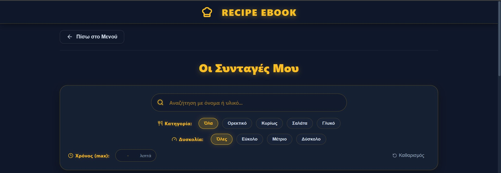 | 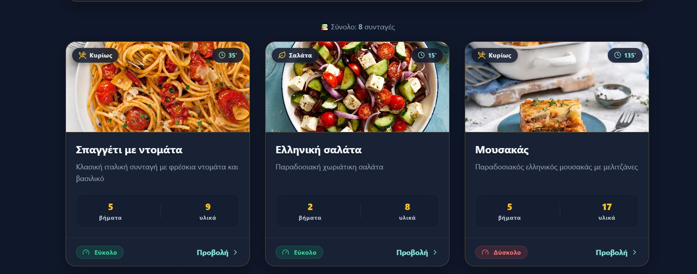   |

### Προβολή Λεπτομερειών
Επισκόπηση της Καρτέλας μιας συνταγής που περιλαμβάνει τα υλικά της, τα βήματα της και τις φωτογραφίες της!

| Καρτέλα Συνταγής | Υλικά & Βήματα | Φωτογραφίες Συνταγής |
|:---:|:---:|:---:|
| 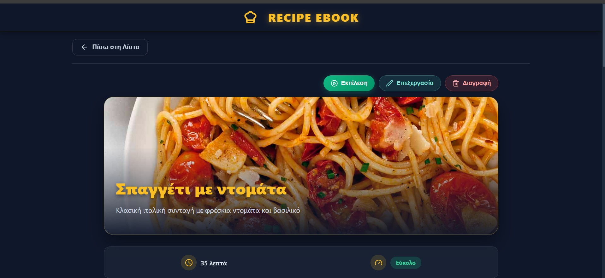 | 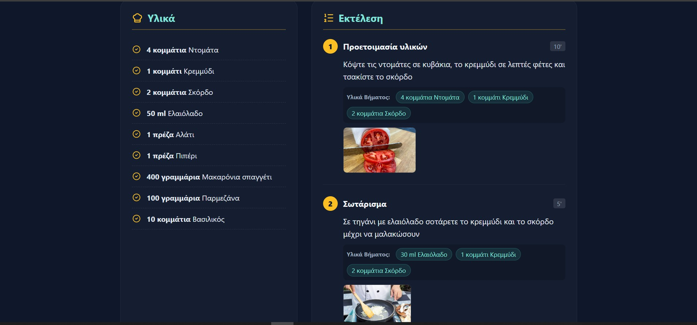 | 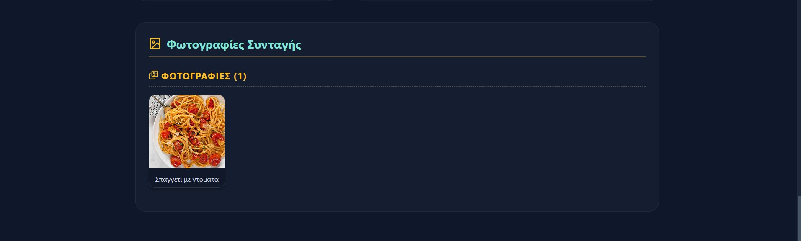 |

### Δημιουργία Συνταγής
Η διαδικασία δημιουργίας νέας συνταγής βήμα-προς-βήμα.

| Δημιουργία Συνταγής |Προσθήκη Υλικών Συνταγής | Προσθήκη Βημάτων Συνταγής | Προσθήκη Φωτογραφιών Συνταγής |
|:---:|:---:|:---:|:---:|
| 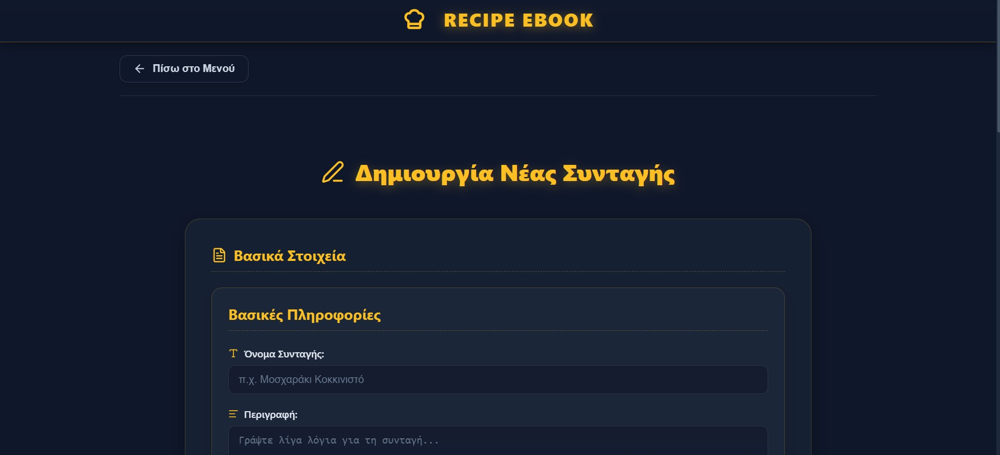 | 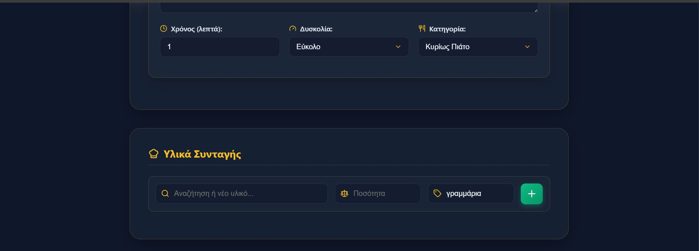 | 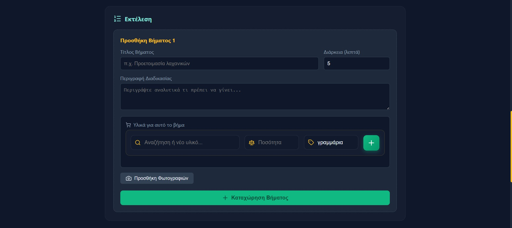 | 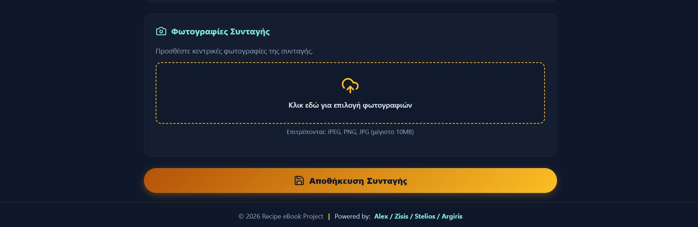 |

###  Επεξεργασία Συνταγής
Διαχείριση και τροποποίηση της συνταγής.

| Επεξεργασία Συνταγής | Επεξεργασία Υλικών Συνταγής | Επεξεργασία Βήματος Συνταγής | Επεξεργασία Φωτογραφιών Συνταγής |
|:---:|:---:|:---:|:---:|
|  |  | 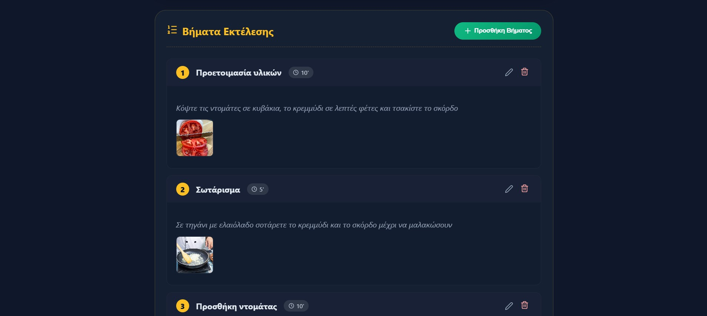 | 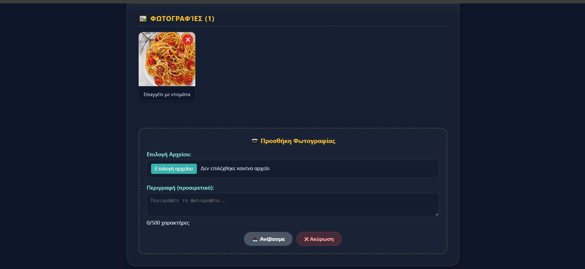 |


### Επεξεργασία Βημάτων Συνταγής 
Διαχείριση Βήματος μια Συνταγής

Επεξεργασία Υλικών και Φωτογραφιών Βήματος

|  |

### Λειτουργία Εκτέλεσης
Η Λειτουργία Εκτέλεσης της Συνταγής!

| Έναρξη Εκτέλεσης | Κατά την Διάρκεια της εκτέλεσης| Λήξη εκτέλεσης |
|:---:|:---:|:---:|
| 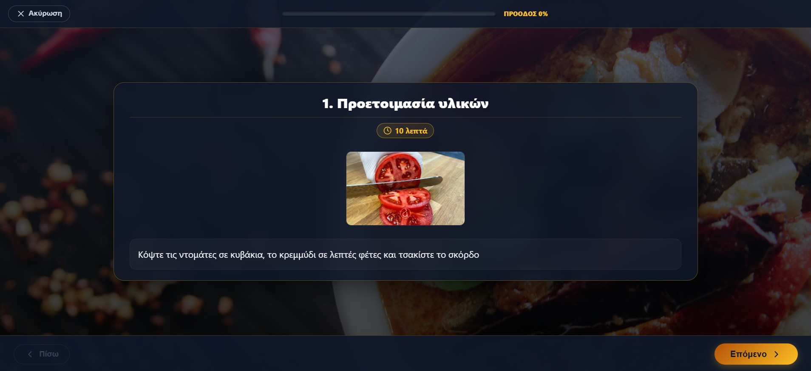 | 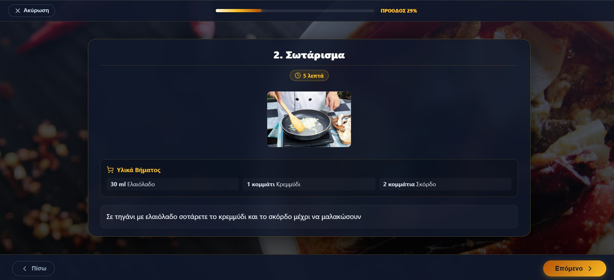 | 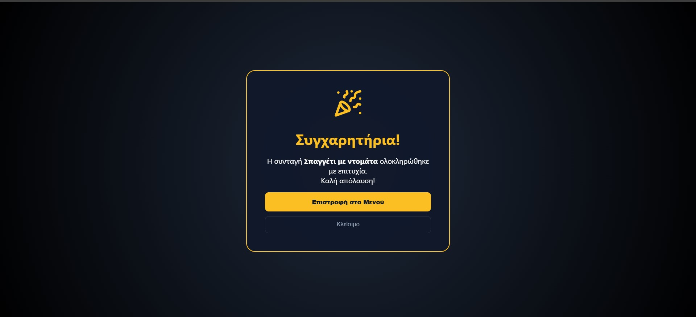 |

